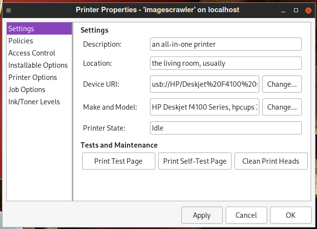
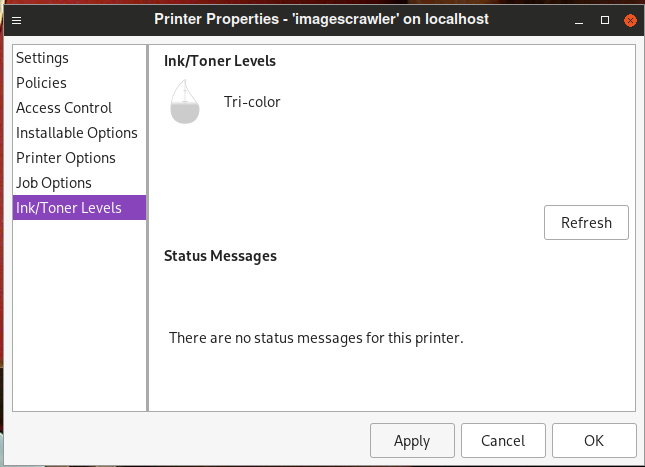
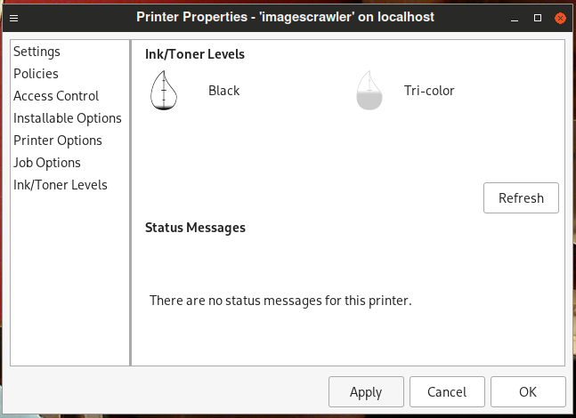

dj3600command
=============

What is it?
-----------
Do you compile HPLIP with `--enable-hpcups-only` and miss knowing how
much ink you have left? Would you like to be able to print the
alignment page from your printer any time? Are you okay with level one
cleaning?

Then this is for you!

Obligatory Warning
------------------
This software is barely alpha-quality. There's a test case, but it's
not comprehensive. My printer isn't often connected anymore. Upgrading
your printer should be considered a serious alternative to using this
software. Besides, who likes relocating one's laptop to within USB
cable range of one's printer?

Building it
-----------
`$ meson setup build`
`$ meson compile -C build`

Should you be using my custom HPLIP Meson build, dj3600command will
find the `hpmud` library and use that to query the printer if the
printer is set to use the HP backend. Using your distribution's HPLIP?
Set the Meson build option `hpbackend` to `enabled` and we will try
linking with `hpmud` anyway. **Note that the build will fail** if
`hpmud` was not built as a shared library by your distribution and
this option is set.

Support for the standard CUPS USB backend is also included if you like
to build HPLIP with `--enable-hpcups-only`. This is always built, so you
don't need to set anything for this to happen. Just select the USB backend
when setting up the printer.

Be sure to use the supplied PPD file when setting up the printer. If
you've customized one, feel free to apply the supplied patch.

Known Supported Printers
------------------------
- Hewlett-Packard DeskJet F4180 All-in-One

Untested Printers
-----------------
- Every other printer ever

Using It
--------
This command filter implements the commands `Clean all`, `PrintSelfTestPage`,
and `ReportLevels`, most of which you can issue from the Web-based interface
or a tool like `system-config-printer`.

`PrintSelfTestPage` prints the self-alignment scanning sheet one usually
gets when installing new ink cartridges and turning the printer on.

`Clean all` performs a level one cleaning.

Examples
--------

To Do
-----
- Actual test cases
- Somehow integrate this with hplip-printer-app, as that's the future
